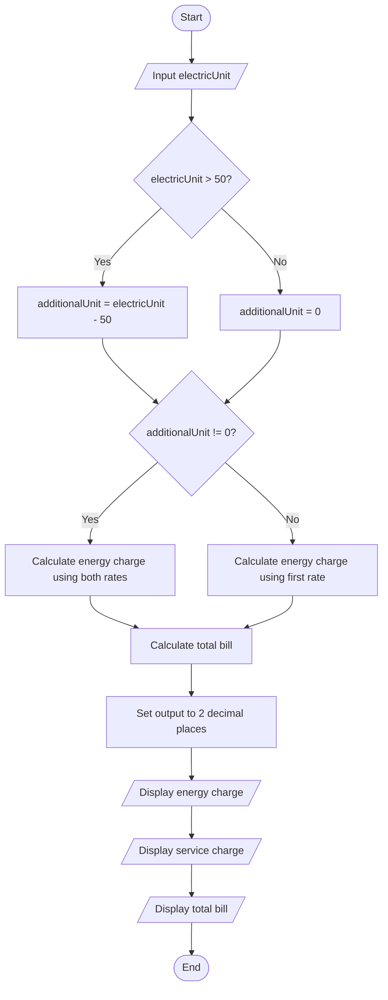

# Electricity Bill Flowchart

This flowchart illustrates the logic used to calculate
the electricity bill.

```mermaid
flowchart TD
    A([Start]) --> B[/Input electricUnit/]
    B --> C{electricUnit > 50?}

    C -- Yes --> D[additionalUnit = electricUnit - 50]
    C -- No --> E[additionalUnit = 0]

    D --> F{additionalUnit != 0?}
    E --> F

    F -- Yes --> G[Calculate energy charge using both rates]
    F -- No --> H[Calculate energy charge using first rate]

    G --> I[Calculate total bill]
    H --> I

    I --> J[Set output to 2 decimal places]
    J --> K[/Display energy charge/]
    K --> L[/Display service charge/]
    L --> M[/Display total bill/]
    M --> N([End])
```
